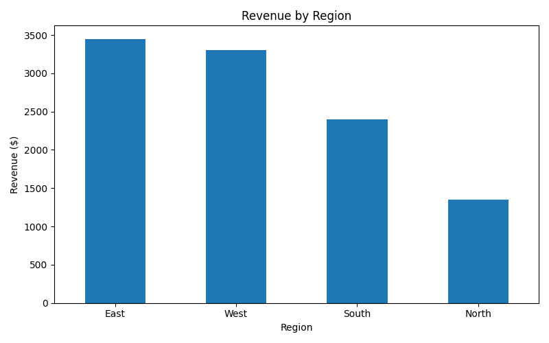
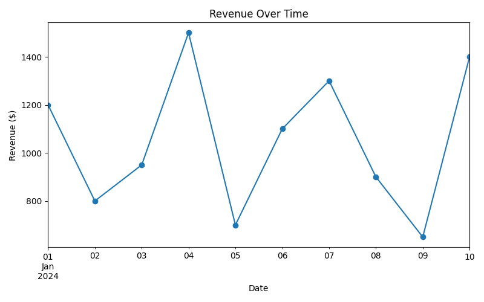

# Business Operations Dashboard

## Overview

A Python-based dashboard that analyzes sales data, generates key business insights, and visualizes performance trends using charts.

## Features

- Loads and analyzes CSV sales data
- Calculates total revenue
- Shows revenue by region
- Identifies the top-performing product
- Creates charts for business insights

## Business Insights

- Total revenue across all sales
- Highest-performing region
- Top-performing product
- Revenue trend over time

## How It Works

1. Loads sales data from a CSV file
2. Processes data using Pandas
3. Calculates key business metrics
4. Generates visualizations using Matplotlib
5. Displays results in the terminal and saves charts as images

## Example Output




## Project Structure

```text
business-operations-dashboard/
├── data/
│   └── sales_data.csv
├── analysis.py
├── charts.py
├── dashboard.py
├── requirements.txt
├── README.md
└── .gitignore
```
## Technologies Used

- Python
- Pandas
- Matplotlib

## Future Improvements

- interactive filters by region or product
- support for larger datasets
- export summary results to CSV
- Streamlit web dashboard version

## Installation

```bash
pip install -r requirements.txt
